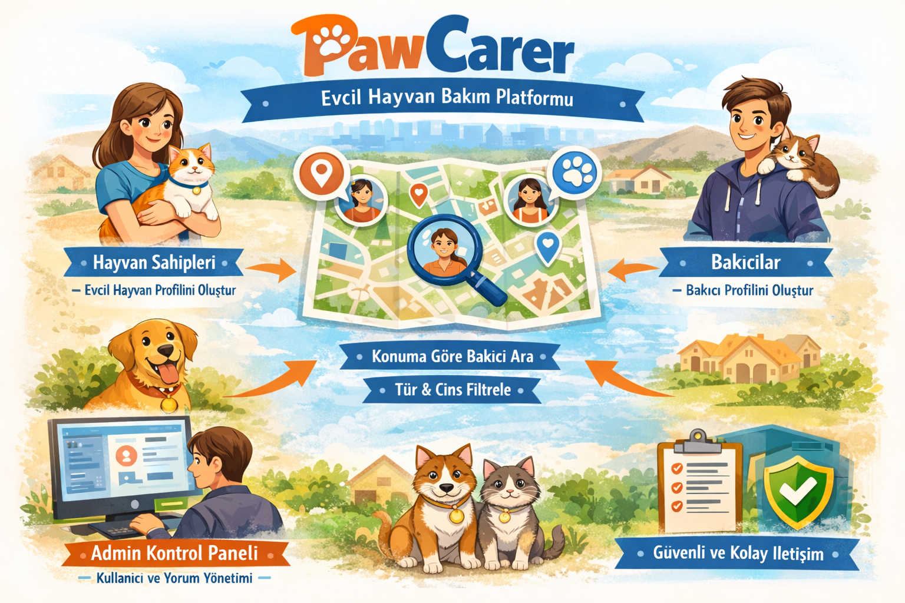

# PawCarer

## Proje Hakkında

**Proje Tanımı:** 
PawCarer, evcil hayvan sahipleri ile bakıcıları buluşturan bir bakım/rezervasyon platformudur. Hayvan sahipleri hesap oluşturarak evcil hayvan profili ekleyebilir, konuma göre uygun bakıcıları arayabilir ve hayvan türü/cinsine göre filtreleyebilir. Bakıcılar kendi profillerini oluşturarak hizmet bilgilerini yönetebilir. Sistem üzerinden bakıcılara yorum yapılabilir, yorumlar güncellenebilir ve bakıcı puanı yorum yıldızlarının ortalamasına göre görüntülenir. Admin tarafında kullanıcı/bakıcı/yorum yönetimi ve rol yetkilendirme işlemleri yapılır.

**Proje Kategorisi:** 
Evcil Hayvan Bakımı / Hizmet Platformu

**Referans Uygulama:** !!!!!!!!!!!!!!
> [PetSitter](https://petsittertr.com/)

---

## Proje Linkleri

- **REST API Adresi:** [api.yazmuh.com](https://api.yazmuh.com)
- **Web Frontend Adresi:** [frontend.yazmuh.com](https://frontend.yazmuh.com)

---

## Proje Ekibi

**Grup Adı:** 
MuslumTheCat
**Ekip Üyeleri:** 
- Esra Yaman
- Toprak Yavuz

---

## Dokümantasyon

Proje dokümantasyonuna aşağıdaki linklerden erişebilirsiniz:

1. [Gereksinim Analizi](Gereksinim-Analizi.md)
2. [REST API Tasarımı](API-Tasarimi.md)
3. [REST API](Rest-API.md)
4. [Web Front-End](WebFrontEnd.md)
5. [Mobil Front-End](MobilFrontEnd.md)
6. [Mobil Backend](MobilBackEnd.md)
7. [Video Sunum](Sunum.md)

